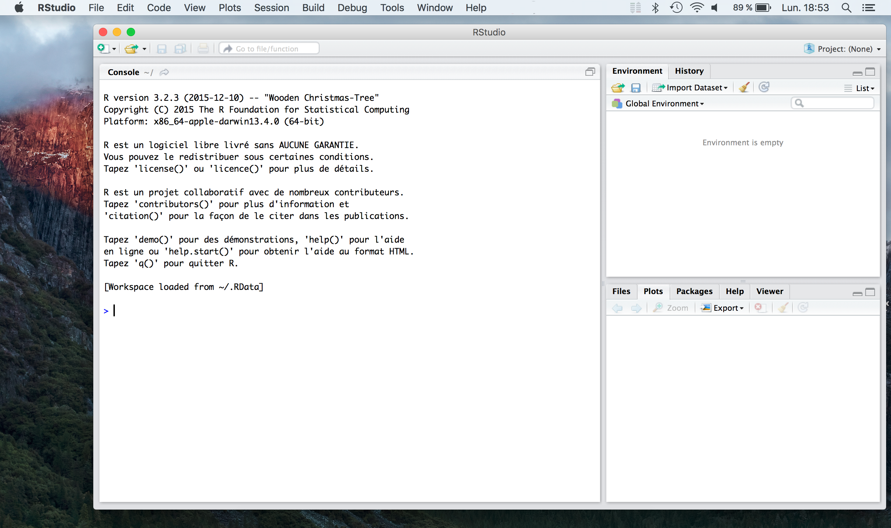
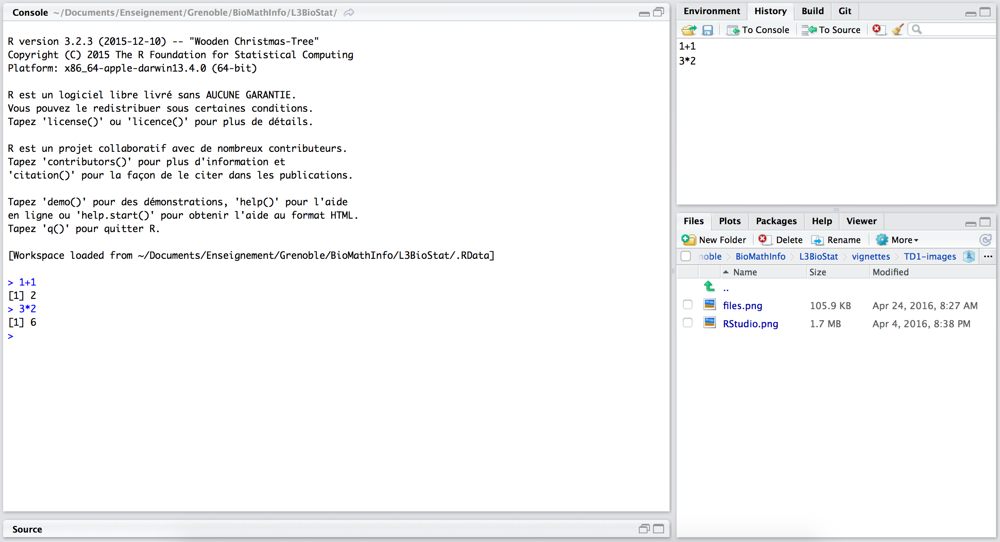
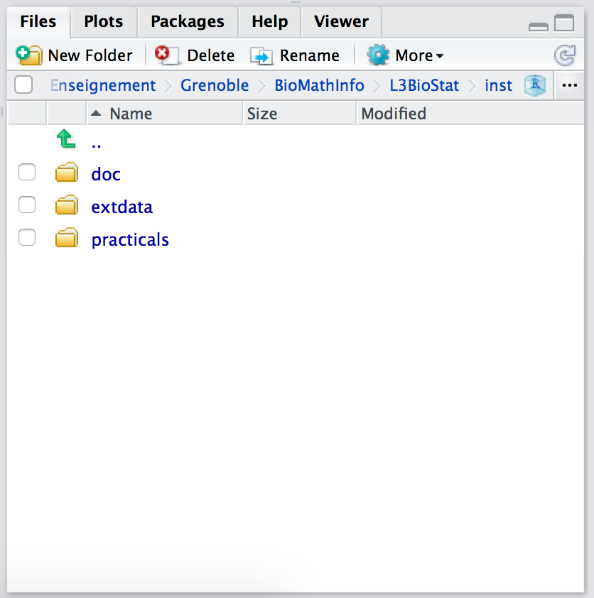
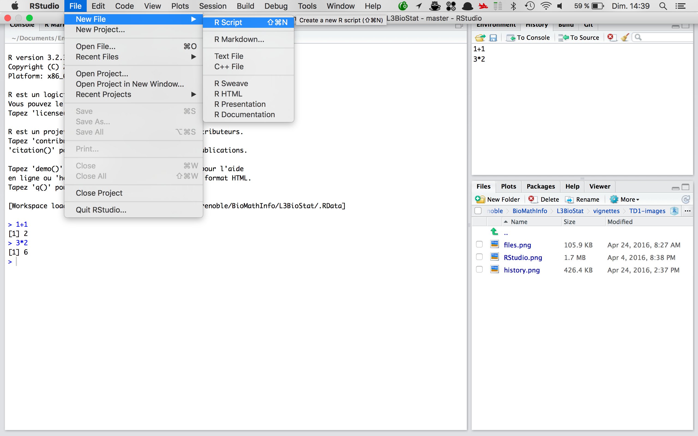
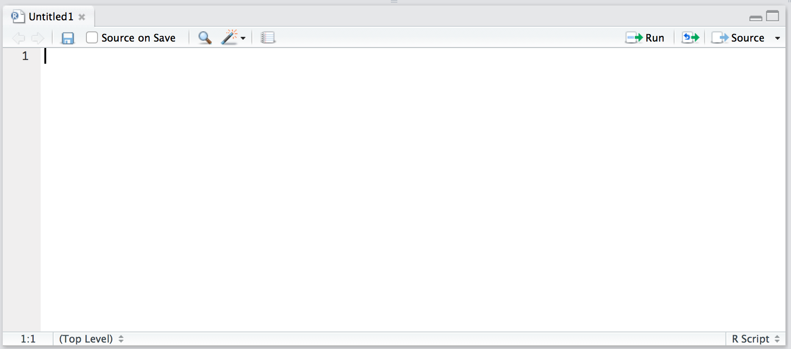

```{r, echo=FALSE, fig.height=2.7, fig.width=9}
library(knitr)
```


![Rlogo] est un langage informatique dédié à l'analyse statistique. 
On manipule les données sous **R** par l'intermédiaire de commandes 
qui doivent être saisies dans un interpréteur.

Le but de cette séance est d'apprendre à utiliser **R** en Mode calculatrice.

# Installer **R** sur son ordinateur

**R** est un logiciel libre que vous pouvez installer gratuitement sur votre 
ordinateur, peu importe son type ou son système d'exploitation (PC Windows ou Linux, Mac)
Pour faciliter notre travail nous allons installer en réalité deux logiciels: 
**R** et **RStudio**. 


> Installez bien ces logiciels dans cet ordre car **RStudio** dépend de **R**.

## Installer R

**R** se télécharge librement à partir du site du CRAN (The Comprehensive R Archive Network).

<center>
https://cran.r-project.org
</center>

Il existe des packages pour toutes les machines courament utilisées

- Linux (differentes distribution)
- MacOSX
- Windows

Vous devez télécherger le package correspondant à votre machine et l'installer

## Installer RStudio

Dans un second temps, vous devez installer **RStudio**. **RSutdio** est un environement 
graphique facilitant l'utilisation de **R**. Vous pouvez télécharger **RStudio** gratuitement
pour votre machine à l'adresse suivante:

<center>
https://www.rstudio.com/products/rstudio/
</center>

Vous devez télécharger le package **RStudio Desktop** correspondant à votre machine et l'installer.


# Mes premiers pas avec ![Rlogo]

## Lancer RStudio

Une fois installé, il suffit de cliquer sur l'icone de l'application. Une fenetre s'ouvre et est divisée en trois parties. L'interface est en anglais.

```{r, echo=FALSE, out.width=640, fig.retina = NULL}

```

La partie gauche de l'écran correspond à la console. C'est dans cette sous-fenêtre que vous taperez vos commande **R**

La partie de droite et elle même divisée en deux. Chacune d'elles comporte plusieurs onglets. 

* Dans la partie haute vous trouverez notamment un onglet `history` dans lequel vous retrouverez toutes les commandes que vous avez tapées dans la console.
* Dans la partie basse trois onglets vous interesseront particulièrement:
    + Files : qui vous permet de naviguer dans vos fichiers
    + Plots : Dans cet onglet s'affichera vos graphiques
    + Help  : qui vous permet de consulter l'aide des différentes fonction de **R**
  
  
## La fenêtre "Console" 
```{r first_addtion}
1+1
```

## La fenêtre "History"

```{r, echo=FALSE, out.width=640, fig.retina = NULL}

```

## La fenêtre "Files"

```{r, echo=FALSE, out.width=300, fig.retina = NULL}

```

## La fenêtre d'édition de textes

```{r, echo=FALSE, out.width=640, fig.retina = NULL}

```


```{r, echo=FALSE, out.width=450, fig.retina = NULL}

```

# Les données sous R

## Les principaux types de données

### Les numériques

### Les chaînes de caractères

### Les valeurs logiques

## Les principaux opérateurs

### Les opérateurs numériques

```{r, echo=FALSE}
operators = c("+","-","*","/","**","%%")
opnames=c("addition","soustraction","multiplication","division","puissance","modulo")
kable(data.frame("Operateur"=operators,"Nom"=opnames))
```

```{r}
2 - 3
2 * 3
2 ** 3
```

### Les opérateurs logiques

```{r, echo=FALSE}
bool.values=c(TRUE,FALSE)
names(bool.values)=as.character(bool.values)
kable(outer(bool.values,bool.values,'&'))
```

```{r, echo=FALSE}
kable(outer(bool.values,bool.values,'|'))
```

```{r, echo=FALSE}
not=matrix(mapply('!',bool.values),nrow=1,ncol=2)
colnames(not)=as.character(bool.values)
kable(not)
```


### Les opérateurs de comparaison


## L'organisation des données en vecteurs

### Construire son premier vecteur de données

### Construire un vecteur quelconque

### Quelques autres methodes utiles

### Combiner les méthodes de construction

## Acceder aux éléments d'un vecteur

### Accéder à un élément en particulier

### Accéder simultamement à un groupe d'élément

### Selectionnner des éléments sur la base d'une condition

plus souvent les
données sont enregistrées dans un fichier que l'on demande à R de lire. R construit lors de cette 
lecture une 'feuille de données' (`data.frame`) que nous devons ranger dans un objet. La commande 
si dessous lit le fichier `peuplier.txt` et range le `data.frame` créé dans l'objet `peuplier.

- Never uses retina figures
- Has a smaller default figure size
- Uses a custom CSS stylesheet instead of the default Twitter Bootstrap style

## Vignette Info

Note the various macros within the `vignette` section of the metadata block above. These are required in order to instruct R how to build the vignette. Note that you should change the `title` field and the `\VignetteIndexEntry` to match the title of your vignette.

## Styles

The `html_vignette` template includes a basic CSS theme. To override this theme you can specify your own CSS in the document metadata as follows:

    output: 
      rmarkdown::html_vignette:
        css: mystyles.css

## Figures

The figure sizes have been customised so that you can easily put two images side-by-side. 

```{r, fig.show='hold'}
plot(1:10)
plot(10:1)
```

You can enable figure captions by `fig_caption: yes` in YAML:

    output:
      rmarkdown::html_vignette:
        fig_caption: yes

Then you can use the chunk option `fig.cap = "Your figure caption."` in **knitr**.

## More Examples

You can write math expressions, e.g. $Y = X\beta + \epsilon$, footnotes^[A footnote here.], and tables, e.g. using `knitr::kable()`.

```{r, echo=FALSE, results='asis'}
knitr::kable(head(mtcars, 10))
```

Also a quote using `>`:

> "He who gives up [code] safety for [code] speed deserves neither."
([via](https://twitter.com/hadleywickham/status/504368538874703872))

[Rlogo]: images/RSmall.png "R"
